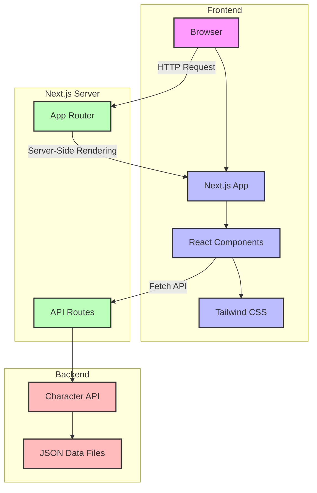

A modern, full-stack web application showcasing characters from the beloved sci-fi animated series Futurama. Built with Next.js, React, and Tailwind CSS.

## 🏗️ Architecture

This project uses a full-stack Next.js architecture with no separate backend server. All data is stored in JSON files and served through Next.js API routes.

<details>
<summary>View diagram</summary>



</details>

For a detailed explanation of the architecture, see [Architecture Documentation](docs/arquitecture.md) ([Spanish](docs/arquitectura.md))

## 🌌 Features

- **Character Gallery**: Browse all Futurama characters with a sleek, responsive UI
- **Detailed Character Profiles**: View in-depth information about each character including:
  - Personal details (species, gender, age, home planet)
  - Character images
  - Famous quotes
  - Occupations and skills
- **Futuristic UI**: Space-themed design with animations and effects that capture the essence of the year 3000
- **Responsive Design**: Optimized for all devices from mobile to desktop
- **Fast Performance**: Built with Next.js for optimal loading speeds and SEO

## 🛸 Tech Stack

- **Frontend**: React 18, Next.js 13.4
- **Styling**: Tailwind CSS with custom Futurama-themed components
- **Data**: Local JSON with comprehensive character information
- **Icons**: React Icons
- **Animations**: CSS transitions and Tailwind utilities

## 🔧 Installation

1. Clone the repository:
   ```bash
   git clone https://github.com/yourusername/futurama.git
   cd futurama
   ```

2. Install dependencies:
   ```bash
   npm install
   ```

3. Run the development server:
   ```bash
   npm run dev
   ```

4. Open [http://localhost:3000](http://localhost:3000) in your browser

## 📁 Project Structure

```
/app                  # Next.js app directory
  /api                # API routes
    /characters       # Character data endpoints
  /characters         # Character detail pages
  /page.jsx           # Homepage
/components           # Reusable React components
/data                 # JSON data sources
/public               # Static assets
```

## 🌐 API Routes

- `GET /api/characters` - Returns a list of all characters
- `GET /api/characters/[slug]` - Returns detailed information about a specific character

## 🔮 Future Enhancements

- User authentication to save favorite characters
- Episode information and character appearances
- Interactive Planet Express ship map
- Character relationship visualizations
- Search and filter functionality

## 📚 Resources

- [sampleapis.com Futurama API](https://api.sampleapis.com/futurama/characters) - Reference API
- [Futurama fandom](https://futurama.fandom.com)
- [futuramaapi.com](https://futuramaapi.com) - Quotes API

## 📄 License

This project is licensed under the MIT License - see the [LICENSE](LICENSE) file for details.

## 🤝 Contributing

Contributions are welcome! Please check out our [Contributing Guide](CONTRIBUTING.md) for details.

## 🙏 Acknowledgements

- Matt Groening and the creators of Futurama
- The Next.js and React teams
- All contributors to this project