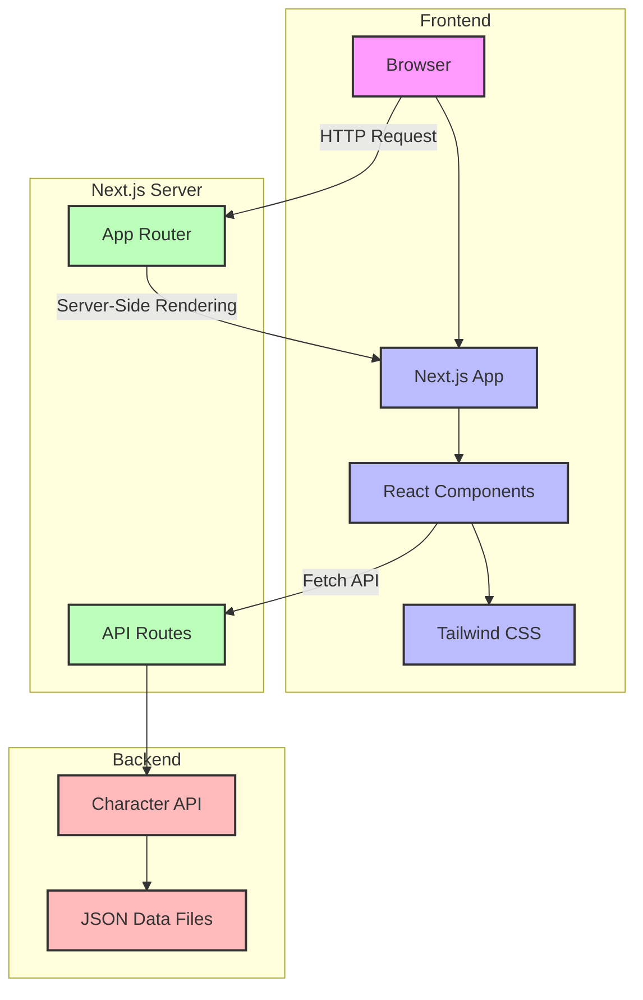

```mermaid
graph TD
    subgraph "Frontend"
        A[Browser] --> B[Next.js App]
        B --> C[React Components]
        C --> D[Tailwind CSS]
    end
    
    subgraph "Next.js Server"
        E[App Router]
        F[API Routes]
    end
    
    subgraph "Backend"
        F --> G[Character API]
        G --> H[JSON Data Files]
    end
    
    A -- "HTTP Request" --> E
    E -- "Server-Side Rendering" --> B
    C -- "Fetch API" --> F
    
    style A fill:#f9f,stroke:#333,stroke-width:2px
    style B fill:#bbf,stroke:#333,stroke-width:2px
    style C fill:#bbf,stroke:#333,stroke-width:2px
    style D fill:#bbf,stroke:#333,stroke-width:2px
    style E fill:#bfb,stroke:#333,stroke-width:2px
    style F fill:#bfb,stroke:#333,stroke-width:2px
    style G fill:#fbb,stroke:#333,stroke-width:2px
    style H fill:#fbb,stroke:#333,stroke-width:2px
```
